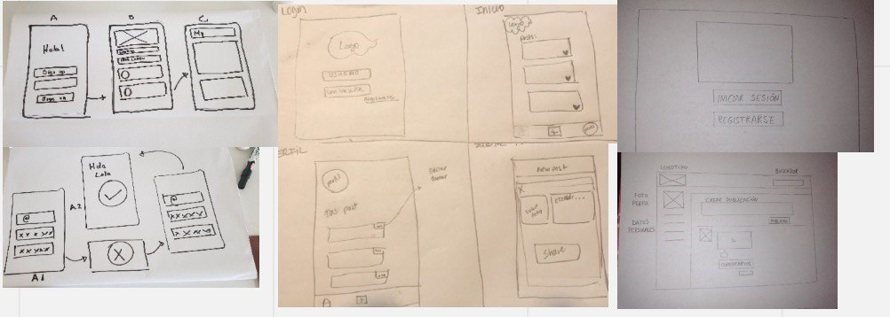
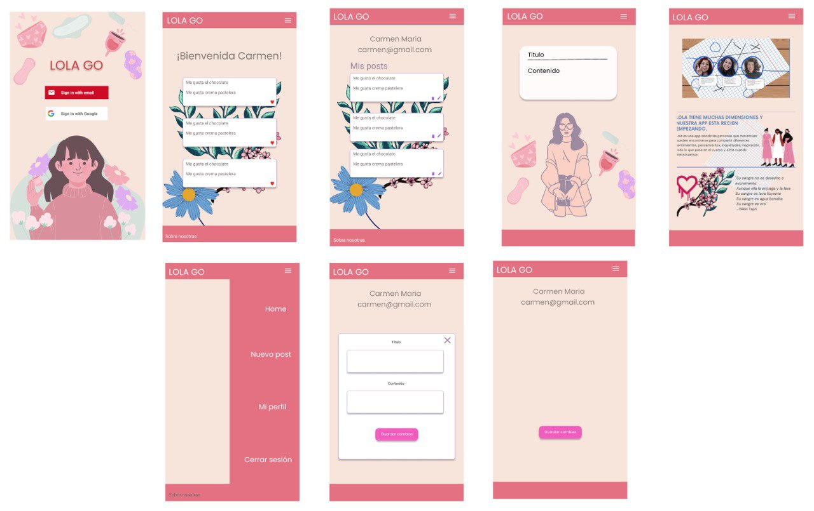

  
## Nombre del proyecto
Red Social: Lola Go with the Flow

## Autoras:
Camila Castro
Pamela Pérez
Alejandra Olea

Laboratoria generación 2021

## Resumen del proyecto:

Lola Go es nuestra idea para el tercer proyecto en el bootcamp de Laboratoria.  Desde que se nos ocurrió, simplemente nos encantó!  Lola es una app donde las personas que menstrúan pueden encontrarse para compartir diferentes dimensiones, sentimientos, pensamientos, inquietudes, inspiración en fin todo lo que pasa en el cuerpo y alma cuando menstruamos 
Lola tiene muchas dimensiones y nuestra app esta recién empezando.
## Usuarios 

Personas que menstrúan

## Problema que resuelve el producto:

Las personas vivimos diferentes emociones y sensaciones cuando estamos menstruando, poder compartir con otras trae una nueva dimensión mágica, pachamamica, de  amistad, de sentimientos, pensamientos, inquietudes.  Nuestra app Lola Go es un espacio virtual de encuentro para todo esto. 

## Diseño de la Interfaz de Usuario:

Prototipos:

Para ver UX ir a:
https://miro.com/app/board/o9J_lM-yoLo=/

Para ver UI ir a: 
https://www.figma.com/file/XOpO54V0tSYYFtj95rhb0G/Prototipo-Red-Social?node-id=18%3A78

